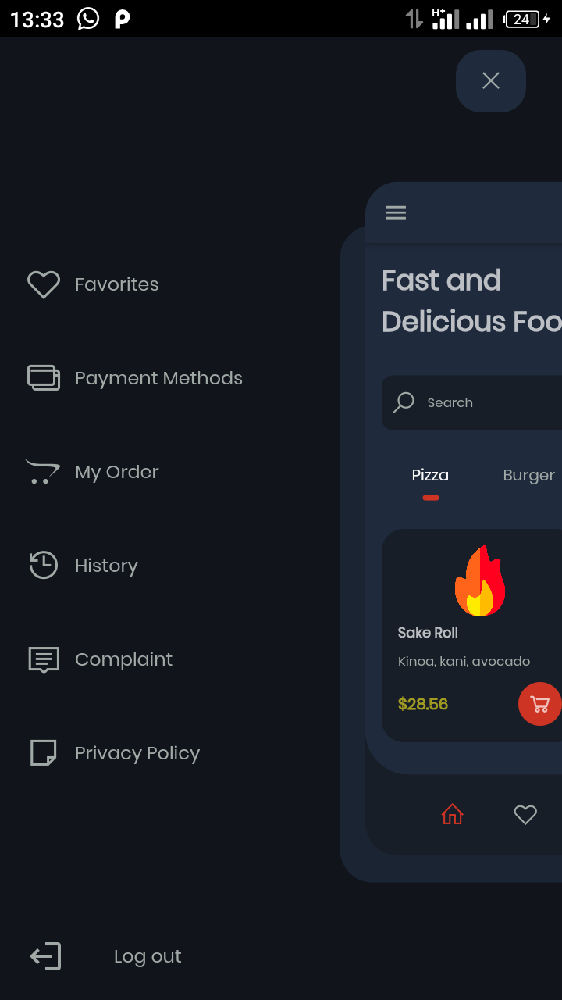
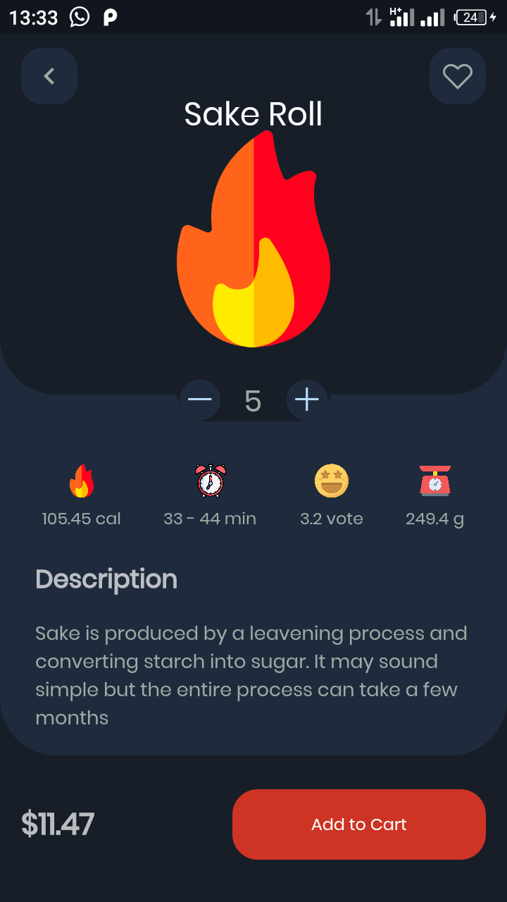
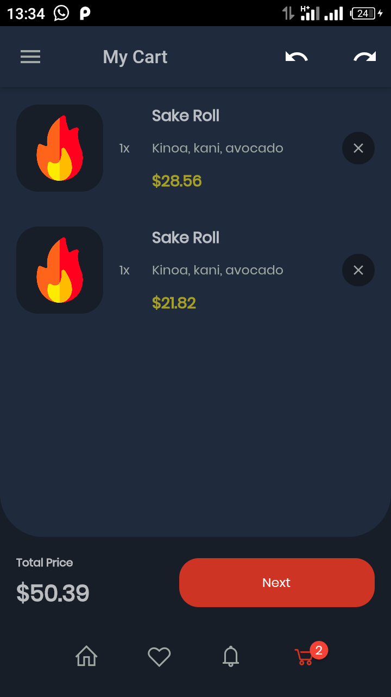
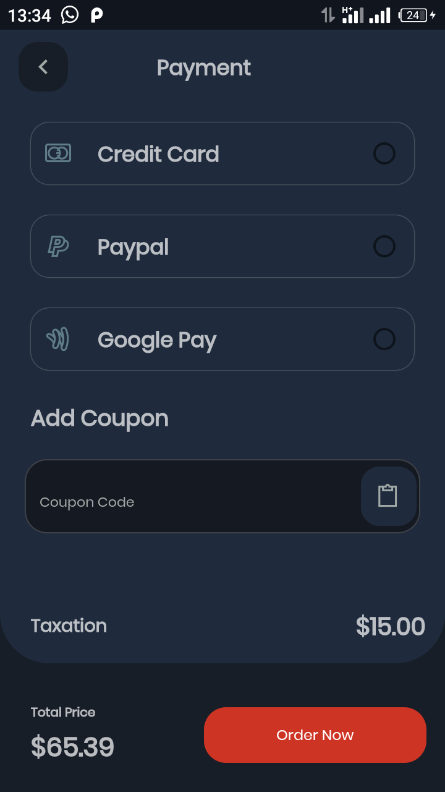
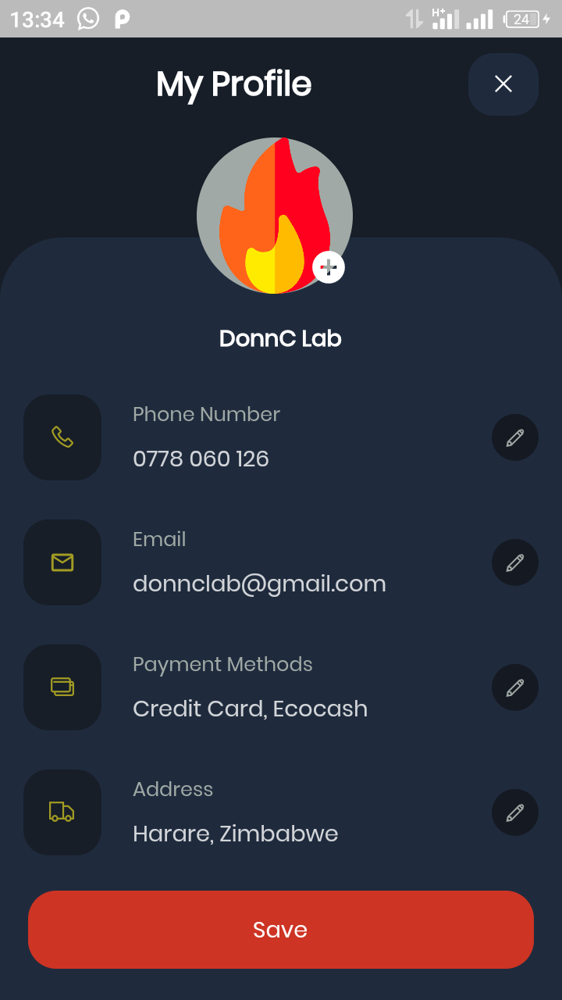
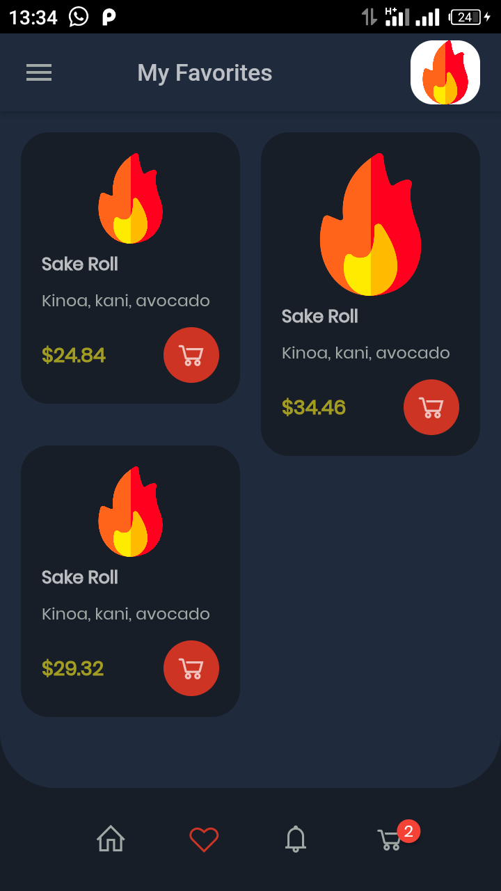
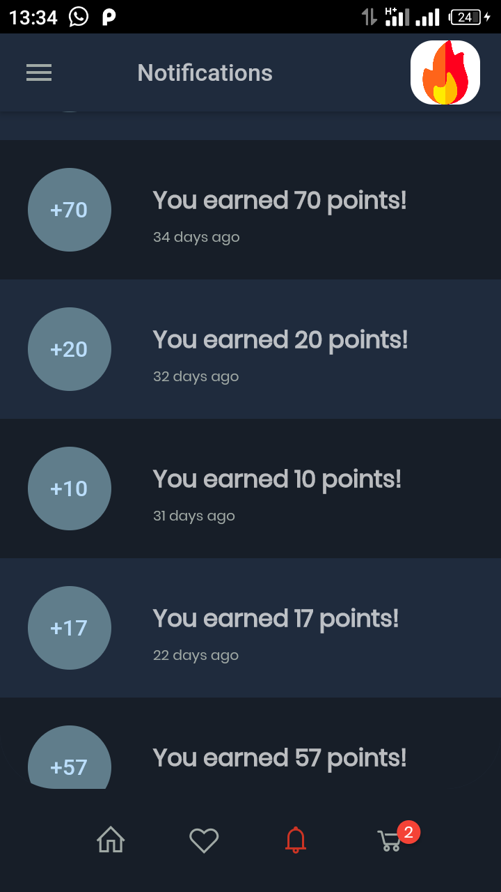

# [Flutter Food App](https://www.behance.net/gallery/108452151/Food-Delivery-App-UI-Kit)
a full-stack flutter food delivery mobile app

### Mobile app
- A food delivery app based on `behance` design by [Huzeyfe](https://www.behance.net/gallery/108452151/Food-Delivery-App-UI-Kit)

### Latest Demo video [here](demo/vid.mp4)


## [Original design](https://www.behance.net/gallery/108452151/Food-Delivery-App-UI-Kit)
<table>
   <tr>
      <td> Login-Sign-Forgot</td>
      <td> Home-Detail-Cart</td>
      <td> Map-Notify-Drawer</td>
      <td> Order-Connection</td>
      <td> Pay-Profile</td>
   </tr>
   <tr>
      <td></td>
      <td></td>
      <td></td>
      <td></td>
      <td></td>
   </tr>
</table>

## My Flutter App attempt
<table>
   <tr>
      <td> Home-Page</td>
      <td> Product details page</td>
      <td> Cart page</td>
      <td> Order page</td>
   </tr>
   <tr>
      <td></td>
      <td></td>
      <td></td>
      <td></td>
   </tr>
</table>

- more
<table>
   <tr>
      <td> Profile page</td>
      <td> Favorite Page</td>
      <td> Notification page</td>
   </tr>
   <tr>
      <td></td>
      <td></td>
      <td></td>
   </tr>
</table>

## Features
- Food App `Flutter` client in [app_client](app_client/lib)
- Food App `Aqueduct` server in [app_server](app_server/lib)
- ✔ Powered by flutter & [Momentum](https://xamdev.gq/momentum/) state management
- [Aqueduct](https://aqueduct.io/) dart back-end server

## TODOs
- [x] Add cart badge counter
- [x] Add undo & redo delete buttons on cart page
- [x] Add shimmer loading effect on home page
- [x] Add staggered grid view on `Favorite-Page` 
- [ ] Add more app pages
- [ ] Add proper products images and profile avatar
- [ ] Fix aqueduct backend server
- [ ] Connect front-end to back-end api (to replace fake data)
- [ ] Add dialog service for snackbars, toasts etc on certain events
- [ ] Implement search and filter on home page
- [ ] Implement momentum`s event listen on controller fired events
- [ ] Add animations and custom navigation transitions
- [x] Fix cart page `time-travel` (undo & redo on cart product delete)
- [ ] Fix scaffolled menu `Multiple duplicate Global Key` & `incorrect use of Parent Widget` problem
- [ ] Fix `Profile-Page` pixel overlap on profile-field edit
- [ ] Fix `Order-Page` pixel overlap on using `coupon` textfield
- [ ] Fix `Login-Page` textfield error validations messages
- [ ] Code improvement & Bug fixes

## Support 🎉
📌 ```I work on this project on my personal time, some pages & features are left out and some features i add on my own as i see fit and discover.
Im also learning some concepts, be it on front-end or back-end and trying to implement them.
 If you need a particular feature to be implemented asap or an issue or help, submit an issue - i might find time for it. Happy fluttering 🎈```
- 🌟 `Star` this repo if you find this helpful
- 🔱 `Fork` | PR if you would like to contribute or add your own flavours
- ✨ Support `Huzeyfe` on [behance](https://www.behance.net/huzeyfeb)
